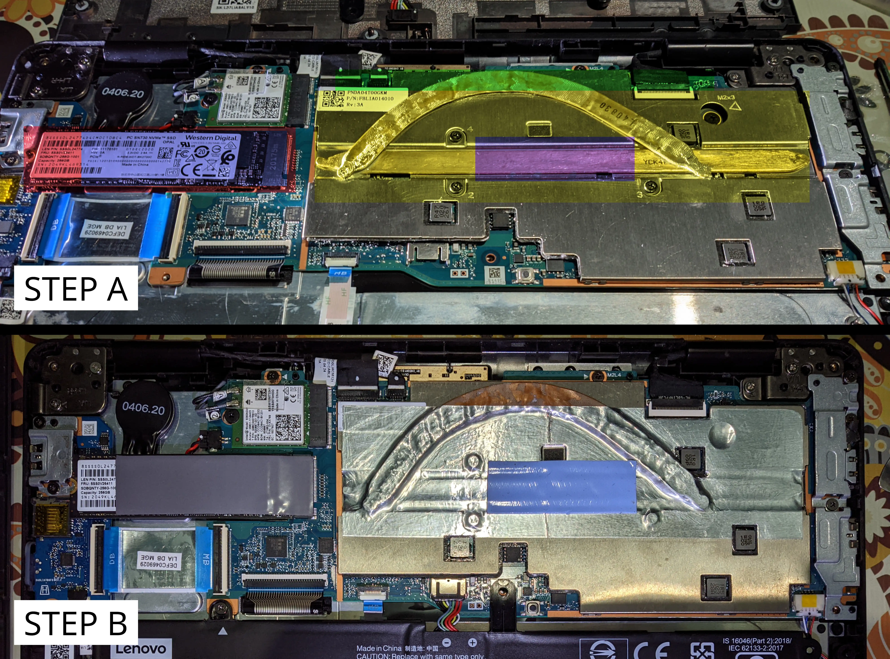

```
Lenovo (ThinkPad) Yoga 11e 6th Gen (2022)

Artix Linux-Zen

Intel® Core™ m3-8100Y with 4GB x2 LPDDR3-2133
11.6" HD IPS TS with Corning® Gorilla® Glass
2W x2 Stereo Dolby® Advanced Audio
```

Lenovo ThinkPad 11e Yoga Gen 6 is considered the most energy-efficient 2-in-1 laptop which adequately packaged. The
Intel Core m3 Gen 8 Y-series processor and Intel SoC brings the laptop into long-term gadget on most situation. When we
use Linux as default operating system and to unlock full potential, it goes beyond expectation. It was **absolutely
exquisite**. The stock hardware does not really need to change/upgrade, until we measure there is something to do.

## Display Screen

The built-in 11.6" HD IPS screen includes touch digitizer and the bezel are quite perfect for its compact size. Touch
input is used to "cheat" slow keyboard and trackpad input when selecting graphical elements. We just need to "punch" it.

## Keyboard and Trackpad


The built-in keyboard and trackpad is well done, but sad to see no media keys there. Nonetheless, we can remap the keys
by software later. The trackpad's surface is quite soft and sweet to touch and swipe on. There is no useless trackpoint.

## Wireless Connectivity

The built-in Intel Wireless-AC 9260 M.2 WLAN card is good enough and it has good reception depending on our environment.

### A High-Gain Antenna?

~~Despite the reception is fairly good, I am **planning to modify** the case to add a high-gain directional WiFi
antenna.~~ The reason why I **abandon** this is, it is an overengginered modification. Instead, USB 3 was invented to
satisfy this purpose. There are plenty of USB WiFi adapters such as high-gain TP-Link AC1300 (Archer T4U V5) that even
supports both monitor mode and packet injection.

## SSD Storage

When I bought a used ThinkPad, I got a mounted 2280 NVMe SSD. Whereas the original layout it was 2242, which is genius.

## Cooling System



As uses Intel Core Y-series processor as default configuration, the TDP is approximately about 5 watt. It produces less
heat, therefore uses passive cooling system. However, it **would be nice if we modify** the built-in cooling plate by
appending copper plate or slim heat pipe and thermal pad to the outermost surface of the cooling plate. Also, we must
clean the old thermal paste and repaste for better heat conductivity. The hardware temperature were supresses more than
before the modification, keep the temperature warm even if the CPU is under stress.

## Audio and Speakers

Comes with Dolby Advanced Audio, Realtek ALC3287 is quite perfect meets with the built-in stereo speakers. The
5.1-channel surround sound is absolutely works without both software and hardware tuning, even under Linux.

<br>

```
Lenovo (ThinkCentre) M715q Tiny 2nd Gen (2021)

Artix Linux-Zen

AMD Ryzen™ 5 2400GE with 16GB x2 DDR4-3200
22" Frameless FHD IPS HP Monitor
1.5W x1 High Definition Audio
```

| :triangular_flag_on_post: | <b>THIS SECTION IS NOT COMPLETE RIGHT NOW.</b> |
|---------------------------|:-----------------------------------------------|

```
Written by owl4ce.
© 2025 owl4ce
https://github.com/owl4ce/exquisitely
```
