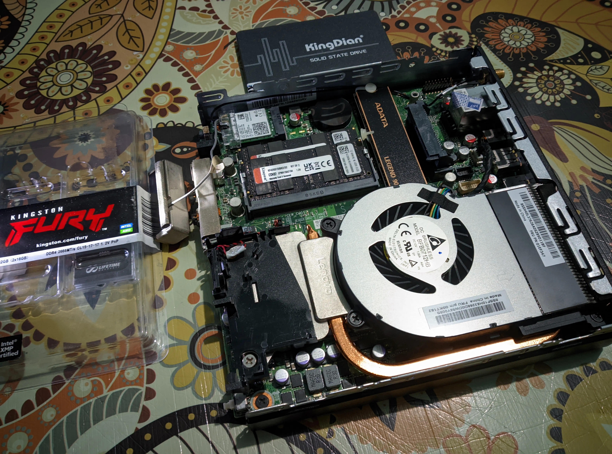
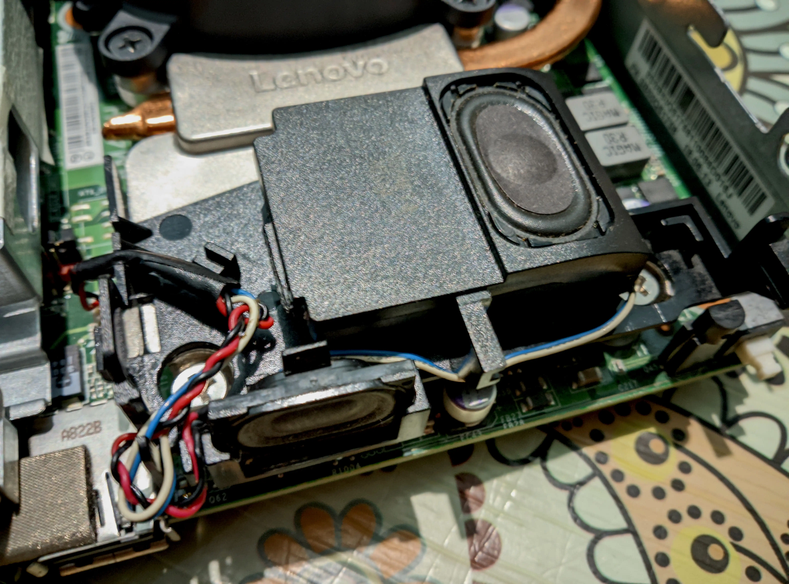

```
Lenovo (ThinkCentre) M715q Tiny 2nd Gen (2021)

Artix Linux-Zen

AMD Ryzen™ 5 2400GE with 16GB x2 DDR4-3000 OC
22" Frameless FHD IPS HP Monitor via DisplayPort
1.5+2W Dual Mono Speakers Realtek® ALC233VB2
```

Lenovo ThinkCentre M715q Gen 2 might be a modest and cost-saving solution for those looking for a compact and powerful
computer to build and tinkering with. The decent AMD Ryzen 5 2400GE APU is mostly sufficient to execute heavy tasks,
depending on our RAM and SSD choices. Moreover, this machine is overclock-able through
[Smokeless_UMAF](https://github.com/DavidS95/Smokeless_UMAF).

## AC Adapter

The original AC adapter was 65W, but using 90W (or higher) AC adapter significantly improve the overall performance due
to the higher ampere availability.

## Display Screen

The built-in display interface are dual DisplayPort on the rear panel, allowing to use any monitor that supports this
interface. An IPS FHD monitor is recommended for better visibility. 

## Keyboard and Mouse

Comes with no serial port. A wired USB 2 keyboard and mouse is recommended for better longevity.

## Wireless Connectivity

The built-in Intel Wireless-AC 9260 M.2 WLAN card is good enough and it has good reception depending on our environment.

### A High-Gain Antenna?

When I bought a refurbished ThinkCentre, it does not include a SMA male WiFi antenna which is connected to the MAIN IPX
and currently only rely on the built-in omnidirectional WiFi antenna that connected to the AUX IPX of the WLAN card.

## RAM and SSD Storage

According to the Lenovo Product Specifications Reference (psref), installed RAM supports up to 32GB DDR4-2666. Although
the APU itself may supports up to 64GB DDR4-3200 or natively 2933MT/s, this is totally untested or may be limited by the
chipset. To get optimal performance-vs-cost trade, I have spent extra $75 to buy (aged stock) DDR4 SODIMM 32GB KINGSTON
FURY KIT 2666MT/s CL15-17-17 and an used 512GB WD 2280 NVMe PCIe 3 SSD with 99% health. I also have a new unused 512GB
KINGDIAN SATA3 SSD, and now installed onto.

## Cooling System



Ensure to clean the old thermal paste and repaste with high conductivity thermal paste.

## Audio and Speakers



The built-in single speaker is too small, producing only hi-frequency tones. Mid-range frequencies are lost due to its
design. Therefore, it **would be good to add** an additional old speaker. I take the left speaker from broken Lenovo
G40 and put onto.

<br>

```
Written by owl4ce.
© 2025 owl4ce
https://github.com/owl4ce/exquisitely
```
